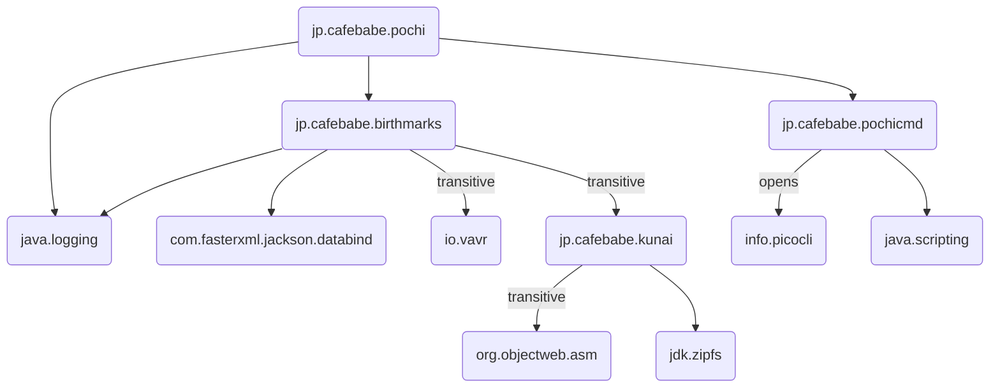

```mermaid
graph TD
  birthmarks(jp.cafebabe.birthmarks)
  pochi(jp.cafebabe.pochi)
  kunai(jp.cafebabe.kunai)
  pochicmd(jp.cafebabe.pochicmd)
  logging(java.logging)
  scripting(java.scripting)
  vavr(io.vavr)
  asm(org.objectweb.asm)
  picocli(info.picocli)
  zipfs(jdk.zipfs)
  jackson(com.fasterxml.jackson.databind)

  pochicmd -- opens --> picocli
  pochicmd --> scripting
  pochi --> logging
  pochi --> birthmarks
  pochi --> pochicmd
  birthmarks --> logging
  birthmarks --> jackson
  birthmarks --transitive--> vavr 
  birthmarks --transitive--> kunai
  kunai --transitive--> asm
  kunai --> zipfs
```

